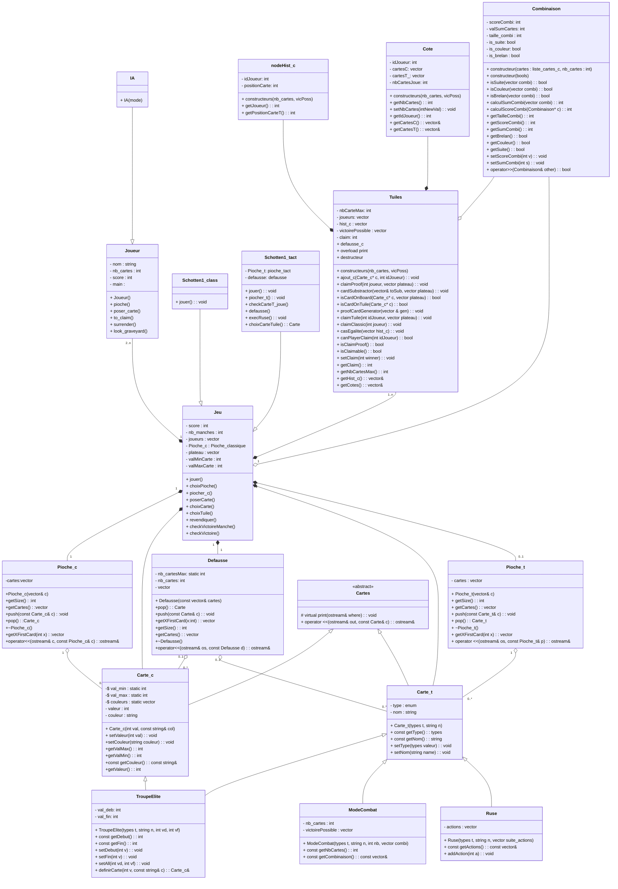

# UML Schotten-Totten LO21

```mermaid
classDiagram
    class Joueur{
        - nom : string
        - nb_cartes : int
        - score : int
        - main : <Cartes>
        + Joueur()
        + pioche()
        + poser_carte()
        + to_claim()
        + surrender()
        + look_graveyard()
    }
    
    class IA{
        + IA(mode)
    }
    
    class Jeu{
        - score : int
        - nb_manches : int
        - joueurs : vector<Joueur*>
        - Pioche_c : Pioche_classique
        - plateau : vector<Tuiles*>
        - valMinCarte : int
        - valMaxCarte : int
        + jouer()
        + choixPioche()
        + piocher_c()
        + poserCarte()
        + choixCarte()
        + choixTuile()
        + revendiquer()
        + checkVictoireManche()
        + checkVictoire()
    }
    
    class Schotten1_class{
        + jouer() : void
    }
    
    class Schotten1_tact{
        - Pioche_t: pioche_tact
        - defausse: defausse
        + jouer() : void 
        + piocher_t() : void
        + checkCarteT_joue()
        + defausse()
        + execRuse() : void
        + choixCarteTuile() : Carte
    }
    
    class Tuiles{
        - nbCarteMax: int
        - joueurs: vector<cote *>
        - hist_c : vector<nodeHist_c *>
        - victoirePossible : vector<Combinaison *> 
        - claim: int
        + constructeurs (nb_cartes, vicPoss)
        + ajout_c(Carte_c* c, int idJoueur) : void
        + claimProof(int joueur, vector<Tuile*> plateau) : void
        + cardSubstractor(vector<Carte_c*>& toSub, vector<Tuile*> plateau) : void
        + isCardOnBoard(Carte_c* c, vector<Tuile*> plateau) : bool
        + isCardOnTuile(Carte_c* c) : bool
        + proofCardGenerator(vector<Carte_c *> & gen) : void
        + claimTuile(int idJoueur, vector<Tuile *> plateau) : void
        + claimClassic(int joueur): void
        + casEgalite(vector<nodeHist_c *> hist_c) : void
        + canPlayerClaim(int idJoueur) : bool
        + isClaimProof() : bool
        + isClaimable() : bool
        + setClaim(int winner): void
        + getClaim(): int
        + getNbCartesMax() : int
        + getHist_c() : vector<nodeHist_c *>&
        + getCotes(): vector<Cote *>&
        + defausse_c
        + overload print
        + destructeur
    }
    
    class nodeHist_c{
        - idJoueur: int
        - positionCarte: int
        + constructeurs (nb_cartes, vicPoss)
        + getJoueur() : int
        + getPositionCarteT() : int
    }
    
    class Combinaison{
        - scoreCombi: int
        - valSumCartes: int
        - taille_combi : int
        - is_suite: bool
        - is_couleur: bool
        - is_brelan : bool
        + constructeur (cartes : liste_cartes_c, nb_cartes : int)
        + constructeur (bools)
        + isSuite(vector<Carte_c*> combi) : bool
        + isCouleur(vector<Carte_c*> combi) : bool
        + isBrelan(vector<Carte_c*> combi) : bool
        + calculSumCombi(vector<Carte_c*> combi) : int
        + calculScoreCombi(Combinaison* c) : int
        + getTailleCombi(): int
        + getScoreCombi() : int
        + getSumCombi() : int
        + getBrelan() : bool
        + getCouleur() : bool
        + getSuite() : bool
        + setScoreCombi(int v) : void
        + setSumCombi(int s) : void
        + operator>>(Combinaison& other) : bool
    }
    
    class Cote{
        - idJoueur: int
        - cartesC: vector<Carte_c *>
        - cartesT_: vector<Carte_T *>
        -  nbCartesJoue: int
        + constructeurs (nb_cartes, vicPoss)
        + getNbCartes() : int
        + setNbCartes(intNewVal) : void
        + getIdJoueur() : int
        + getCartesC() : vector<Carte_c*>&
        + getCartesT() : vector<Carte_t*>&
    }
    
    class Pioche_c{
        -cartes:vector<Carte_c> 
        +Pioche_c(vector<Carte_c>& c)
        +getSize():int
        +getCartes():vector<Carte_c>
        +push(const Carte_c& c):void
        +pop():Carte_c
        +~Pioche_c()
        +getXFirstCard(int x):vector<Carte_c*>
        +operator<<(ostream& c, const Pioche_c& c):ostream&
    }
    
    class Defausse{
        - nb_cartesMax: static int
        - nb_cartes: int 
        - vector<Cartes>
        + Defausse (const vector<Carte>& cartes)
        +pop() : Carte
        +push(const Carte& c) : void
        +getXFirstCard(x:int) : vector<Carte*>
        +getSize() : int
        +getCartes() : vector<Carte>
        +~Defausse()
        +operator<<(ostream& os, const Defausse d) : ostream&
    }
    
    class Pioche_t{
        - cartes : vector<Carte_t>
        + Pioche_t(vector<Carte_t>& c)
        + getSize() : int
        + getCartes() : vector<Carte_t>
        + push(const Carte_t& c) : void
        + pop() : Carte_t
        + ~Pioche_t()
        + getXFirstCard(int x) : vector<Carte_t*>
        + operator << (ostream& os, const Pioche_t& p) : ostream&
    }
    
    class Carte_c{
        -$ val_min : static int
        -$ val_max : static int
        -$ couleurs : static vector<string>
        - valeur : int
        - couleur : string
        + Carte_c(int val, const string& col)
        + setValeur(int val) : void
        +setCouleur(string couleur) : void
        +getValMax() : int
        +getValMin() : int
        +const getCouleur() : const string&
        +getValeur() : int
    }
    
    class Cartes{
        <<abstract>>
        # virtual print(ostream& where) : void
        + operator << (ostream& out, const Carte& c) : ostream&
    }
    
    class Carte_t{
        - type : enum
        - nom : string
        + Carte_t(types t, string n)
        + const getType() : types
        + const getNom() : string
        + setType(types valeur) : void
        + setNom(string name) : void
    }
    
    class TroupeElite{
        - val_deb: int
        - val_fin: int
        + TroupeElite(types t, string n, int vd, int vf)
        + const getDebut() : int
        + const getFin() : int
        + setDebut(int v) : void
        + setFin(int v) : void
        + setAll(int vd, int vf) : void
        + definirCarte(int v, const string& c) : Carte_c&
    }
    
    class ModeCombat{
        - nb_cartes : int
        - victoirePossible : vector<Combinaison*>
        + ModeCombat(types t, string n, int nb, vector<Combinaison*> combi)
        + const getNbCartes() : int
        + const getCombinaison() : const vector<Combinaison*>&
    }
    
    class Ruse{
        - actions : vector<int>
        + Ruse(types t, string n, vector<int> suite_actions)
        + const getActions() : const vector<int>&
        + addAction(int a) : void
    }
    
    IA --|> Joueur
    Joueur "2..n" --* "1" Jeu
    Schotten1_class --|> Jeu
    Schotten1_tact --|> Jeu
    Tuiles "1..n" --* "1" Jeu
    nodeHist_c --* Tuiles
    Cote --* Tuiles
    Combinaison --o Tuiles
    Combinaison --o Jeu
    Jeu "1" *-- "1" Pioche_c
    Jeu *-- Carte_c
    Jeu "1" *-- "1" Defausse
    Pioche_c "1" o-- "0..*" Carte_c
    Pioche_t "1" o-- "0..*" Carte_t
    Defausse "0..1" o-- "0..*" Carte_c
    Defausse "0..1" o-- "0..*" Carte_t
    Carte_c <|-- TroupeElite
    Carte_t <|-- TroupeElite
    Carte_t <|-- ModeCombat
    Carte_t <|-- Ruse
    Cartes <|-- Carte_c
    Cartes <|-- Carte_t
    Jeu *-- Carte_t
    Jeu "1" *-- "0..1" Pioche_t
```
