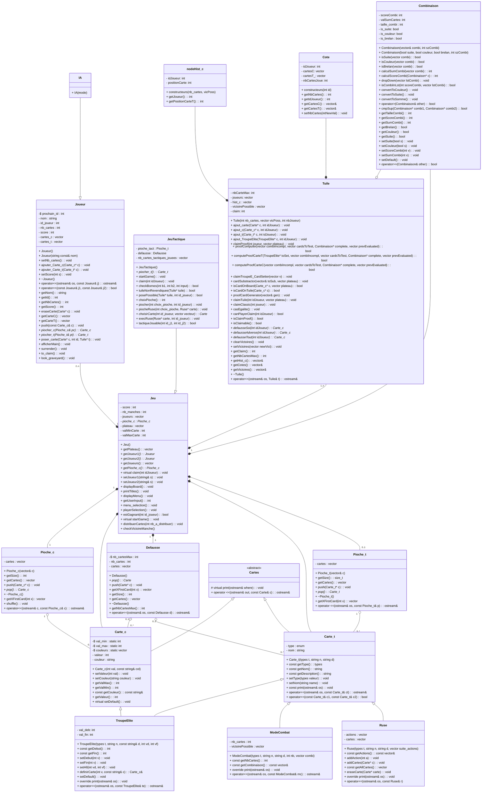

# UML Schotten-Totten LO21

```mermaid
classDiagram
    class Joueur{
    	-$ prochain_id : int
        - nom : string
	- id_joueur : int
        - nb_cartes : int
        - score : int
        - cartes_c : vector<Carte_c*>
	- cartes_t : vector<Carte_t*>
        + Joueur()
	+ Joueur(string const& nom)
	+ setNb_cartes() : void
	+ ajouter_Carte_c(Carte_c* c) : void
	+ ajouter_Carte_t(Carte_t* c) : void
	+ setScore(int s) : void
	+ ~Joueur()
	+ operator<<(ostream& os, const Joueur& j) : ostream&
	+ operator==(const Joueur& j1, const Joueur& j2) : bool
	+ getNom() : string
	+ getId() : int
	+ getNbCartes() : int
	+ getScore() : int
	+ eraseCarte(Carte* c) : void
	+ getCarteC() : vector<Carte_c*>
	+ getCarteT() : vector<Carte_t*>
	+ push(const Carte_c& c) : void
	+ piocher_c(Pioche_c& pc) : Carte_c*
	+ piocher_t(Pioche_t& pt) : Carte_t*
	+ poser_carte(Carte* c, int id, Tuile* t) : void
	+ afficherMain() : void
        + surrender() : void
	+ to_claim() : void
        + look_graveyard() : void
    }
    
    class IA{
        + IA(mode)
    }
    
    class Jeu{
        - score : int
        - nb_manches : int
        - joueurs : vector<Joueur*>
        - pioche_c : Pioche_c*
        - plateau : vector<Tuiles*>
        - valMinCarte : int
        - valMaxCarte : int
        + Jeu()
	+ getPlateau() : vector<Tuile*>
	+ getJoueur1() : Joueur*
	+ getJoueur2() : Joueur*
	+ getJoueurs() : vector<Joueur*>
	+ getPioche_c() : Pioche_c*
	+ virtual claim(int idJoueur) : void
	+ setJoueur1(string& s) : void
	+ setJoueur2(string& s) : void
	+ displayBoard() : void
	+ printTitles() : void
	+ displayMenu() : void
	+ getUserInput() : int
	+ menu_selection() : void
	+ playerSelection() : void
	+ estGagnant(int id_joueur) : bool
	+ virtual startGame() : void
	+ distribuerCartes(int nb_a_distribuer) : void
        + checkVictoireManche()
    }
    
    class JeuTactique{
        - pioche_tact : Pioche_t
        - defausse : Defausse
	- nb_cartes_tactiques_jouees : vector<int>
	+ JeuTactique()
	+ piocher_t() : Carte_t*
        + startGame() : void
	+ claim(int idJoueur) : void
	+ checkBornes(int b1, int b2, int input) : bool
	+ tuileNonRevendiquee(Tuile* tuile) : bool
	+ posePossible(Tuile* tuile, int id_joueur) : bool
	+ choixPioche() : int
	+ piocher(int choix_pioche, int id_joueur) : void
	+ piocheRuse(int choix_pioche, Ruse* carte) : void
	+ choisirCarte(int id_joueur, vector<Carte*> vecteur) : Carte*
	+ execRuse(Ruse* carte, int id_joueur) : void
	+ tactiqueJouable(int id_j1, int id_j2) : bool
    }
    
    class Tuile{
        - nbCarteMax: int
        - joueurs: vector<cote *>
        - hist_c : vector<nodeHist_c *>
        - victoirePossible : vector<Combinaison *> 
        - claim: int
        + Tuile(int nb_cartes, vector<Combinaison*> vicPoss, int nbJoueur)
        + ajout_carte(Carte* c, int idJoueur) : void
	    + ajout_c(Carte_c* c, int idJoueur) : void
	    + ajout_t(Carte_t* c, int idJoueur) : void
	    + ajout_TroupeElite(TroupeElite* c, int idJoueur) : void
        + claimProof(int joueur, vector<Tuile*> plateau) : void
	    + proofComputer(vector<Carte_c*> combiIncompl, vector<Carte_c*> cardsToTest, Combinaison* complete, vector<Carte_c*> prevEvaluated) : bool
	    + computeProofCarteT(TroupeElite* toSet, vector<Carte_c*> combiIncompl, vector<Carte_c*> cardsToTest, Combinaison* complete, vector<Carte_c*> prevEvaluated) : bool
	    + computeProofCarteC(vector<Carte_c*> combiIncompl, vector<Carte_c*> cardsToTest, Combinaison* complete, vector<Carte_c*> prevEvaluated) : bool
	    + claimTroupeE_CardSetter(vector<Carte_c*> v) : void
	    + cardSubstractor(vector<Carte_c*>& toSub, vector<Tuile*> plateau) : void
	    + isCardOnBoard(Carte_c* c, vector<Tuile*> plateau) : bool
	    + isCardOnTuile(Carte_c* c) : bool
	    + proofCardGenerator(vector<Carte_c*>& gen) : void
        + claimTuile(int idJoueur, vector<Tuile*> plateau) : void
	    + claimClassic(int joueur) : void
        + casEgalite() : void
        + canPlayerClaim(int idJoueur) : bool
        + isClaimProof() : bool
        + isClaimable() : bool
        + defausseSoi(int idJoueur) : Carte_c*
	    + defausseAdverse(int idJoueur) : Carte_c*
	    + defausseTout(int idJoueur) : Carte_c*
        + clearVictoires(): void
	    + setVictoires(vector<Combinaison*> newVict) : void
        + getClaim() : int
        + getNbCartesMax() : int
        + getHist_c(): vector<nodeHist_c*>&
        + getCotes(): vector<Cote*>&
        + getVictoires(): vector<Combinaison*>&
        + ~Tuile()
        + operator<<(ostream& os, Tuile& t) : ostream&
    }
    
    class nodeHist_c{
        - idJoueur: int
        - positionCarte: int
        + constructeurs (nb_cartes, vicPoss)
        + getJoueur() : int
        + getPositionCarteT() : int
    }
    
    class Combinaison{
        - scoreCombi: int
        - valSumCartes: int
        - taille_combi : int
        - is_suite: bool
        - is_couleur: bool
        - is_brelan : bool
        + Combinaison(vector<Carte_c*>& combi, int szCombi)
        + Combinaison(bool suite, bool couleur, bool brelan, int szCombi)
        + isSuite(vector<Carte_c*> combi) : bool
        + isCouleur(vector<Carte_c*> combi) : bool
        + isBrelan(vector<Carte_c*> combi) : bool
        + calculSumCombi(vector<Carte_c*> combi) : int
        + calculScoreCombi(Combinaison* c) : int
        + dropDown(vector<Combinaison*> lstCombi) : void
        + isCombiInLst(int scoreCombi, vector<Combinaison*> lstCombi) : bool
        + convertToCouleur() : void
        + convertToSuite() : void
        + convertToSomme() : void
        + operator>(Combinaison& other) : bool
        + cmpSup(Combinaison* combi1, Combinaison* combi2) : bool
        + getTailleCombi(): int
        + getScoreCombi() : int
        + getSumCombi() : int
        + getBrelan() : bool
        + getCouleur() : bool
        + getSuite() : bool
        + setSuite(bool s) : void
        + setCouleur(bool s) : void
        + setScoreCombi(int v) : void
        + setSumCombi(int v) : void
        + setDefault() : void
        + operator>>(Combinaison& other) : bool
    }
    
    class Cote{
        - idJoueur: int
        - cartesC: vector<Carte_c *>
        - cartesT_: vector<Carte_T *>
        - nbCartesJoue: int
        + constructeurs (int id)
        + getNbCartes() : int
        + getIdJoueur() : int
        + getCartesC() : vector<Carte_c*>&
        + getCartesT() : vector<Carte_t*>&
        + setNbCartes(intNewVal) : void
       
    }
    
    class Pioche_c{
        - cartes : vector<Carte_c*> 
        + Pioche_c(vector<Carte_c>& c)
        + getSize() : int
        + getCartes() : vector<Carte_c*>
        + push(Carte_c* c) : void
        + pop() : Carte_c*
        + ~Pioche_c()
        + getXFirstCard(int x):vector<Carte_c*>
	+ shuffle() : void
        + operator<<(ostream& c, const Pioche_c& c) : ostream&
    }
    
    class Defausse{
        -$ nb_cartesMax : int
        - nb_cartes : int 
        - cartes : vector<Carte*>
        + Defausse ()
        + pop() : Carte*
        + push(Carte* c) : void
        + getXFirstCard(int x) : vector<Carte*>
        + getSize() : int
        + getCartes() : vector<Carte*>
        + ~Defausse()
	+ getNbCartesMax() : int
        + operator<<(ostream& os, const Defausse d) : ostream&
    }
    
    class Pioche_t{
        - cartes : vector<Carte_t*>
        + Pioche_t(vector<Carte_t*>& c)
        + getSize() : size_t
        + getCartes() : vector<Carte_t*>
        + push(Carte_t* c) : void
        + pop() : Carte_t*
        + ~Pioche_t()
        + getXFirstCard(int x) : vector<Carte_t*>
        + operator << (ostream& os, const Pioche_t& p) : ostream&
    }
    
    class Carte_c{
        -$ val_min : static int
        -$ val_max : static int
        -$ couleurs : static vector<string>
        - valeur : int
        - couleur : string
        + Carte_c(int val, const string& col)
        + setValeur(int val) : void
        + setCouleur(string couleur) : void
        + getValMax() : int
        + getValMin() : int
        + const getCouleur() : const string&
        + getValeur() : int
	+ virtual setDefault() : void
    }
    
    class Cartes{
        <<abstract>>
        # virtual print(ostream& where) : void
        + operator << (ostream& out, const Carte& c) : ostream&
    }
    
    class Carte_t{
        - type : enum
        - nom : string
        + Carte_t(types t, string n, string d)
        + const getType() : types
        + const getNom() : string
        + const getDescription() : string
        + setType(types valeur) : void
        + setNom(string name) : void
        + const print(ostream& os) : void
	+ operator<<(ostream& os, const Carte_t& ct) : ostream&
	+ operator==(const Carte_t& c1, const Carte_t& c2) : bool
    }
    
    class TroupeElite{
        - val_deb: int
        - val_fin: int
        + TroupeElite(types t, string n, const string& d, int vd, int vf)
        + const getDebut() : int
        + const getFin() : int
        + setDebut(int v) : void
        + setFin(int v) : void
        + setAll(int vd, int vf) : void
        + definirCarte(int v, const string& c) : Carte_c&
	+ setDefault() : void
	+ override print(ostream& os) : void
	+ operator<<(ostream& os, const TroupeElite& te) : ostream&
    }
    
    class ModeCombat{
        - nb_cartes : int
        - victoirePossible : vector<Combinaison*>
        + ModeCombat(types t, string n, string d, int nb, vector<Combinaison*> combi)
        + const getNbCartes() : int
        + const getCombinaison() : const vector<Combinaison*>&
	+ override print(ostream& os) : void
	+ operator<<(ostream& os, const ModeCombat& mc) : ostream&
    }
    
    class Ruse{
        - actions : vector<int>
	- cartes : vector<Carte*>
        + Ruse(types t, string n, string d, vector<int> suite_actions)
        + const getActions() : const vector<int>&
        + addAction(int a) : void
	+ addCartes(Carte* c) : void
	+ const getAllCartes() : vector<Carte*>
	+ eraseCarte(Carte* carte) : void
	+ override print(ostream& os) : void
	+ operator<<(ostream& os, const Ruse& r)
    }
    
    IA --|> Joueur
    Joueur "2..n" --* "1" Jeu
    JeuTactique --|> Jeu
    Tuile "1..n" --* "1" Jeu
    nodeHist_c --* Tuile
    Cote --* Tuile
    Combinaison --o Tuile
    Combinaison --* Jeu
    Jeu "1" *-- "1" Pioche_c
    Jeu *-- Carte_c
    Jeu "1" *-- "1" Defausse
    Pioche_c "1" o-- "0..*" Carte_c
    Pioche_t "1" o-- "0..*" Carte_t
    Defausse "0..1" o-- "0..*" Carte_c
    Defausse "0..1" o-- "0..*" Carte_t
    Carte_c <|-- TroupeElite
    Carte_t <|-- TroupeElite
    Carte_t <|-- ModeCombat
    Carte_t <|-- Ruse
    Cartes <|-- Carte_c
    Cartes <|-- Carte_t
    Jeu *-- Carte_t
    Jeu "1" *-- "0..1" Pioche_t
```
